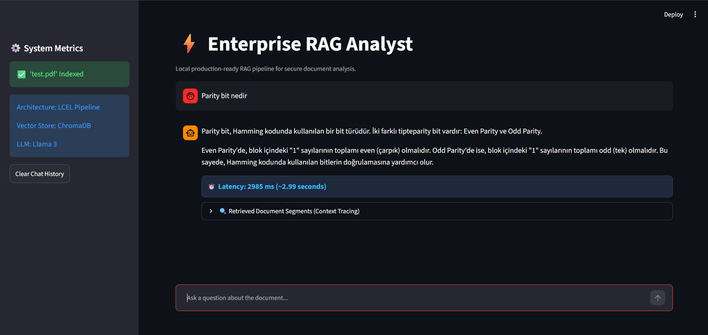

# local-pdf-rag-analyst

A fully local Retrieval-Augmented Generation (RAG) pipeline designed for secure PDF document analysis. This system enables natural language interactions with sensitive documents while ensuring 100% data privacy by executing entirely on local infrastructure.

## Application Preview


## Key Features
* **100% Local Execution:** Powered by Ollama (Llama 3) and HuggingFace BGE Embeddings for complete data privacy.
* **Token Streaming:** Implements a word-by-word streaming interface built over Streamlit for premium responsiveness.
* **Context Tracing:** Shows exactly which text segments and page numbers from the source PDF were retrieved to construct the response.
* **Performance Telemetry:** Monitors and exposes precise end-to-end processing latency metrics in milliseconds (ms).
* **Conversational Memory:** Features message preservation to handle follow-up questions seamlessly.

## Tech Stack
* **Language:** Python
* **Orchestration:** LangChain / LCEL
* **LLM:** Ollama (Llama 3)
* **Embedding Model:** BAAI / bge-small-en-v1.5
* **Vector Store:** ChromaDB
* **Frontend UI:** Streamlit

## Architecture Details
* **Ingestion Layer:** `PyPDFLoader` extracts text from local `test.pdf`.
* **Chunking Engine:** `RecursiveCharacterTextSplitter` splits document (`chunk_size=600`, `overlap=60`).
* **Embedding & DB:** `BAAI/bge-small-en-v1.5` converts chunks to vectors and stores them in local `ChromaDB`.
* **Inference:** LangChain pipeline formats prompt with history and context, then passes it to local `Ollama` server.

## Installation & Quick Start

### 1. Prerequisites
Ensure you have Ollama installed and running with Llama 3 model:
```bash
ollama run llama3
```
##Start
```bash
streamlit run app.py
